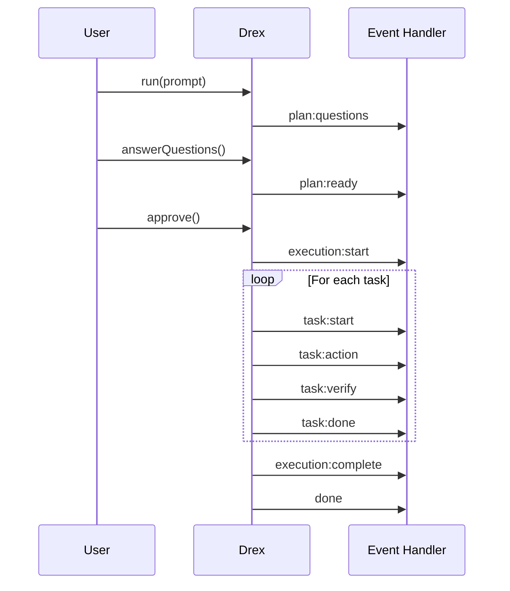

# API Reference & Integration Guide

This document provides a comprehensive reference for integrating DREX Core into your applications, including the public API, event system, and practical examples.

---

## Installation

```bash
# Using Bun
bun add drex-core

# Using npm
npm install drex-core

# Using yarn
yarn add drex-core
```

---

## Public API

### Drex Class (Orchestrator)

The primary entry point for DREX Core is the `Drex` class, which manages the entire orchestration flow.

```typescript
import { Drex } from 'drex-core';

const drex = new Drex(config: DrexConfig);
```

#### Constructor

```typescript
constructor(config: DrexConfig)
```

**Parameters:**

| Parameter | Type | Required | Description |
|-----------|------|----------|-------------|
| `config.llm` | `LLMConfig` | Yes | LLM provider configuration |
| `config.rootDir` | `string` | No | Root directory for operations (default: `process.cwd()`) |
| `config.permissionLevel` | `PermissionLevel` | No | Permission level (default: `'moderate'`) |
| `config.maxConcurrency` | `number` | No | Max concurrent tasks (default: `3`) |
| `config.verbose` | `boolean` | No | Enable verbose logging (default: `false`) |

---

### Methods

#### `run()`

Execute a complete autonomous coding session.

```typescript
async run(prompt: string, options?: RunOptions): Promise<Summary>
```

**Parameters:**

| Parameter | Type | Required | Description |
|-----------|------|----------|-------------|
| `prompt` | `string` | Yes | The task description for the AI |
| `options` | `RunOptions` | No | Additional run options |

**RunOptions:**

```typescript
interface RunOptions {
  /** Skip the approval step */
  autoApprove?: boolean;
  
  /** Pre-answered questions */
  answers?: Answer[];
  
  /** Initial context files */
  contextFiles?: string[];
}
```

**Returns:** `Promise<Summary>`

```typescript
interface Summary {
  /** Whether the run completed successfully */
  success: boolean;
  
  /** Total tasks executed */
  totalTasks: number;
  
  /** Tasks that passed */
  passedTasks: number;
  
  /** Tasks that failed */
  failedTasks: number;
  
  /** Files modified during execution */
  modifiedFiles: string[];
  
  /** Commands executed */
  commands: string[];
  
  /** Error message if failed */
  error?: string;
}
```

**Example:**

```typescript
const summary = await drex.run(
  'Add a new API endpoint for user authentication',
  { autoApprove: true }
);

console.log(`Completed: ${summary.passedTasks}/${summary.totalTasks} tasks`);
console.log(`Modified files: ${summary.modifiedFiles.join(', ')}`);
```

---

#### `plan()`

Generate a plan without executing it.

```typescript
async plan(prompt: string): Promise<Plan>
```

**Parameters:**

| Parameter | Type | Required | Description |
|-----------|------|----------|-------------|
| `prompt` | `string` | Yes | The task description |

**Returns:** `Promise<Plan>`

```typescript
interface Plan {
  /** Generated questions (if any) */
  questions: Question[];
  
  /** Generated tasks */
  tasks: Task[];
  
  /** Estimated complexity */
  complexity: 'low' | 'medium' | 'high';
}

interface Task {
  /** Unique task identifier */
  id: string;
  
  /** Task type */
  type: 'edit' | 'create' | 'delete' | 'command';
  
  /** Task description */
  description: string;
  
  /** Files involved */
  files: string[];
  
  /** Task dependencies */
  dependencies: string[];
}

interface Question {
  /** Question ID */
  id: string;
  
  /** Question text */
  question: string;
  
  /** Suggested answers (if any) */
  suggestions?: string[];
}
```

**Example:**

```typescript
const plan = await drex.plan('Implement user authentication');

if (plan.questions.length > 0) {
  console.log('Questions need answering:');
  plan.questions.forEach(q => console.log(`- ${q.question}`));
}

console.log('Tasks:');
plan.tasks.forEach(t => console.log(`- [${t.id}] ${t.description}`));
```

---

#### `answerQuestions()`

Provide answers to generated questions.

```typescript
async answerQuestions(answers: Answer[]): Promise<Plan>
```

**Parameters:**

| Parameter | Type | Required | Description |
|-----------|------|----------|-------------|
| `answers` | `Answer[]` | Yes | Array of answers |

**Answer:**

```typescript
interface Answer {
  /** Question ID being answered */
  questionId: string;
  
  /** The answer text */
  answer: string;
}
```

**Returns:** `Promise<Plan>` - Updated plan with answers incorporated

**Example:**

```typescript
const plan = await drex.plan('Add caching to the API');

if (plan.questions.length > 0) {
  const answers = [
    { questionId: plan.questions[0].id, answer: 'Redis' },
    { questionId: plan.questions[1].id, answer: '1 hour TTL' },
  ];
  
  const updatedPlan = await drex.answerQuestions(answers);
}
```

---

#### `approve()`

Approve a generated plan for execution.

```typescript
async approve(): Promise<void>
```

**Example:**

```typescript
const plan = await drex.plan('Refactor the database layer');

// Review the plan...
console.log('Tasks to execute:', plan.tasks);

// Approve to start execution
await drex.approve();
```

---

#### `reset()`

Reset the orchestrator to initial state.

```typescript
reset(): void
```

**Example:**

```typescript
// After a run completes or fails
drex.reset();

// Ready for a new run
await drex.run('New task');
```

---

#### `getState()`

Get the current orchestrator state.

```typescript
getState(): OrchestratorState
```

**Returns:** `OrchestratorState`

```typescript
type OrchestratorState = 
  | 'IDLE'
  | 'PLANNING'
  | 'AWAITING_ANSWERS'
  | 'AWAITING_APPROVAL'
  | 'EXECUTING'
  | 'DONE'
  | 'FAILED';
```

---

#### `getPlan()`

Get the current plan (if any).

```typescript
getPlan(): Plan | null
```

---

## Event System

DREX Core emits events throughout the execution lifecycle, allowing you to monitor progress and integrate with external systems.

### Event Flow



### Available Events

| Event | Payload | Description |
|-------|---------|-------------|
| `plan:questions` | `{ questions: Question[] }` | Questions generated during planning |
| `plan:ready` | `{ plan: Plan }` | Plan is ready for approval |
| `execution:start` | `{ taskCount: number }` | Execution phase starting |
| `task:start` | `{ task: Task }` | Individual task starting |
| `task:action` | `{ task: Task, action: Action }` | Action being executed |
| `task:verify` | `{ task: Task, result: VerificationResult }` | Verification completed |
| `task:done` | `{ task: Task, result: AgentResult }` | Task completed |
| `task:fail` | `{ task: Task, error: string }` | Task failed |
| `review:fail` | `{ task: Task, feedback: string }` | Review rejected task |
| `execution:complete` | `{ summary: Summary }` | All tasks completed |
| `done` | `{ summary: Summary }` | Run completed successfully |
| `failed` | `{ error: string, summary: Summary }` | Run failed |
| `error` | `{ error: Error }` | Unhandled error |

### Event Subscription

```typescript
// Subscribe to events
drex.on('task:start', ({ task }) => {
  console.log(`Starting task: ${task.id}`);
});

drex.on('task:done', ({ task, result }) => {
  console.log(`Task ${task.id} completed: ${result.success ? 'OK' : 'FAILED'}`);
});

drex.on('task:fail', ({ task, error }) => {
  console.error(`Task ${task.id} failed: ${error}`);
});

// Subscribe to all events
drex.on('*', (event, payload) => {
  console.log(`Event: ${event}`, payload);
});
```

### Progress Tracking Example

```typescript
class ProgressTracker {
  private total = 0;
  private completed = 0;
  
  constructor(private drex: Drex) {
    drex.on('execution:start', ({ taskCount }) => {
      this.total = taskCount;
      console.log(`Starting execution of ${taskCount} tasks`);
    });
    
    drex.on('task:done', ({ task, result }) => {
      this.completed++;
      const percent = Math.round((this.completed / this.total) * 100);
      console.log(`Progress: ${percent}% (${this.completed}/${this.total})`);
    });
  }
}

const tracker = new ProgressTracker(drex);
await drex.run('Implement feature X');
```

---

## Complete Integration Example

### Basic Usage

```typescript
import { Drex } from 'drex-core';

async function main() {
  const drex = new Drex({
    llm: {
      baseURL: 'https://api.openai.com/v1',
      apiKey: process.env.OPENAI_API_KEY!,
      model: 'gpt-4-turbo-preview',
      extraBody: {
        temperature: 0.3,
        max_tokens: 8192,
      },
    },
    rootDir: process.cwd(),
    permissionLevel: 'moderate',
    maxConcurrency: 3,
    verbose: true,
  });

  // Set up event handlers
  drex.on('task:start', ({ task }) => {
    console.log(`\n▶ Starting: ${task.description}`);
  });

  drex.on('task:done', ({ result }) => {
    if (result.success) {
      console.log(`✓ Completed successfully`);
    } else {
      console.log(`✗ Failed: ${result.error}`);
    }
  });

  // Run the task
  const summary = await drex.run(
    'Add input validation to the user registration endpoint',
    { autoApprove: true }
  );

  console.log('\n=== Summary ===');
  console.log(`Success: ${summary.success}`);
  console.log(`Tasks: ${summary.passedTasks}/${summary.totalTasks}`);
  console.log(`Modified files: ${summary.modifiedFiles.join(', ')}`);
}

main().catch(console.error);
```

### Interactive Mode with Questions

```typescript
import * as readline from 'readline';
import { Drex, Answer } from 'drex-core';

const rl = readline.createInterface({
  input: process.stdin,
  output: process.stdout,
});

async function askQuestion(q: string): Promise<string> {
  return new Promise(resolve => {
    rl.question(q, resolve);
  });
}

async function main() {
  const drex = new Drex({
    llm: {
      baseURL: 'https://api.openai.com/v1',
      apiKey: process.env.OPENAI_API_KEY!,
      model: 'gpt-4-turbo-preview',
    },
    permissionLevel: 'moderate',
  });

  // Generate plan
  const plan = await drex.plan('Implement a new feature');

  // Handle questions interactively
  if (plan.questions.length > 0) {
    console.log('\nThe AI has some questions:\n');
    
    const answers: Answer[] = [];
    
    for (const q of plan.questions) {
      console.log(`Q: ${q.question}`);
      if (q.suggestions?.length) {
        console.log(`Suggestions: ${q.suggestions.join(', ')}`);
      }
      
      const answer = await askQuestion('Your answer: ');
      answers.push({ questionId: q.id, answer });
    }
    
    await drex.answerQuestions(answers);
  }

  // Show final plan
  console.log('\n=== Execution Plan ===');
  const finalPlan = drex.getPlan()!;
  finalPlan.tasks.forEach((task, i) => {
    console.log(`${i + 1}. [${task.id}] ${task.description}`);
    if (task.files.length > 0) {
      console.log(`   Files: ${task.files.join(', ')}`);
    }
  });

  // Ask for approval
  const approve = await askQuestion('\nApprove this plan? (y/n): ');
  
  if (approve.toLowerCase() === 'y') {
    await drex.approve();
    
    // Wait for completion
    drex.on('done', ({ summary }) => {
      console.log('\n=== Completed ===');
      console.log(`Success: ${summary.success}`);
      rl.close();
    });
    
    drex.on('failed', ({ error }) => {
      console.error('\n=== Failed ===');
      console.error(error);
      rl.close();
    });
  } else {
    console.log('Plan rejected.');
    rl.close();
  }
}

main().catch(console.error);
```

### Custom Event Handling

```typescript
import { Drex, Action, VerificationResult } from 'drex-core';

interface ExecutionLog {
  timestamp: Date;
  event: string;
  data: unknown;
}

class DrexMonitor {
  private logs: ExecutionLog[] = [];
  
  constructor(private drex: Drex) {
    this.setupHandlers();
  }
  
  private setupHandlers() {
    this.drex.on('task:start', ({ task }) => {
      this.log('task:start', { taskId: task.id, description: task.description });
    });
    
    this.drex.on('task:action', ({ task, action }) => {
      this.log('task:action', { 
        taskId: task.id, 
        actionType: action.type,
        actionPath: 'path' in action ? action.path : undefined,
      });
    });
    
    this.drex.on('task:verify', ({ task, result }) => {
      this.log('task:verify', {
        taskId: task.id,
        success: result.success,
        issues: result.issues,
      });
    });
    
    this.drex.on('task:done', ({ task, result }) => {
      this.log('task:done', {
        taskId: task.id,
        success: result.success,
        modifiedFiles: result.modifiedFiles,
      });
    });
  }
  
  private log(event: string, data: unknown) {
    this.logs.push({
      timestamp: new Date(),
      event,
      data,
    });
  }
  
  getLogs(): ExecutionLog[] {
    return this.logs;
  }
  
  exportLogs(): string {
    return JSON.stringify(this.logs, null, 2);
  }
}

// Usage
const drex = new Drex(config);
const monitor = new DrexMonitor(drex);

await drex.run('Implement feature');

console.log('Execution log:', monitor.exportLogs());
```

---

## Type Definitions

### Core Types

```typescript
// Permission levels
type PermissionLevel = 'safe' | 'moderate' | 'full';

// LLM Configuration
interface LLMConfig {
  baseURL: string;
  apiKey: string;
  model: string;
  extraBody?: Record<string, unknown>;
}

// Message format
interface Message {
  role: 'system' | 'user' | 'assistant';
  content: string;
}

// DREX Configuration
interface DrexConfig {
  llm: LLMConfig;
  rootDir?: string;
  permissionLevel?: PermissionLevel;
  maxConcurrency?: number;
  verbose?: boolean;
}

// Action types
interface Action {
  type: 'edit_file' | 'create_file' | 'delete_file' | 'run_command';
  path?: string;
  content?: string;
  old_str?: string;
  new_str?: string;
  command?: string;
  cwd?: string;
}

// Action result
interface ActionResult {
  action: Action;
  success: boolean;
  error?: string;
  output?: string;
}
```

### Exported Types

```typescript
// From src/index.ts
export {
  // Main class
  Drex,
  
  // Configuration types
  type DrexConfig,
  type LLMConfig,
  type RunOptions,
  type PermissionLevel,
  
  // Plan types
  type Plan,
  type Task,
  type Question,
  type Answer,
  
  // Execution types
  type Action,
  type ActionResult,
  type AgentResult,
  
  // Verification types
  type VerificationResult,
  type CommandVerification,
  type BrokenImport,
  
  // Summary
  type Summary,
  
  // State
  type OrchestratorState,
};
```

---

## Error Handling

### Common Errors

| Error | Cause | Solution |
|-------|-------|----------|
| `Invalid API key` | Wrong or missing API key | Check `LLMConfig.apiKey` |
| `Path traversal detected` | Attempted access outside root | Use valid paths within `rootDir` |
| `Blocked command pattern` | Dangerous command detected | Use alternative commands |
| `Permission denied` | Action not allowed at current level | Increase `permissionLevel` |
| `Max retries exceeded` | Task failed 3 times | Check task complexity, provide more context |
| `Rate limited` | LLM API rate limit | Implement backoff or use different provider |

### Error Handling Example

```typescript
import { Drex } from 'drex-core';

const drex = new Drex(config);

try {
  const summary = await drex.run('Complex task');
} catch (error) {
  if (error.message.includes('Rate limited')) {
    console.log('Rate limited, waiting before retry...');
    await new Promise(r => setTimeout(r, 60000));
    // Retry
  } else if (error.message.includes('Permission denied')) {
    console.log('Need higher permission level');
    drex.reset();
    // Reconfigure with higher permission
  } else {
    throw error;
  }
}
```

---

## Best Practices

### 1. Environment Configuration

```typescript
// Use environment variables
const drex = new Drex({
  llm: {
    baseURL: process.env.LLM_BASE_URL || 'https://api.openai.com/v1',
    apiKey: process.env.LLM_API_KEY!,
    model: process.env.LLM_MODEL || 'gpt-4',
  },
});
```

### 2. Graceful Shutdown

```typescript
process.on('SIGINT', async () => {
  console.log('Shutting down...');
  drex.reset();
  process.exit(0);
});
```

### 3. Progress Persistence

```typescript
import { writeFileSync } from 'fs';

drex.on('task:done', ({ task, result }) => {
  // Save progress after each task
  writeFileSync('.drex/progress.json', JSON.stringify({
    lastTask: task.id,
    timestamp: new Date().toISOString(),
  }));
});
```

### 4. Context File Preloading

```typescript
// Provide initial context for faster execution
const summary = await drex.run('Update the API', {
  contextFiles: [
    'src/api/index.ts',
    'src/api/routes.ts',
    'src/types/api.ts',
  ],
});
```

---

## Related Documentation

- [Introduction & Architecture](index.md) - Overview of DREX Core
- [LLM Configuration](llm-config.md) - Detailed LLM setup
- [Context Retrieval](context-retrieval.md) - Understanding context building
- [Execution & Verification](execution-verification.md) - Safety and validation
