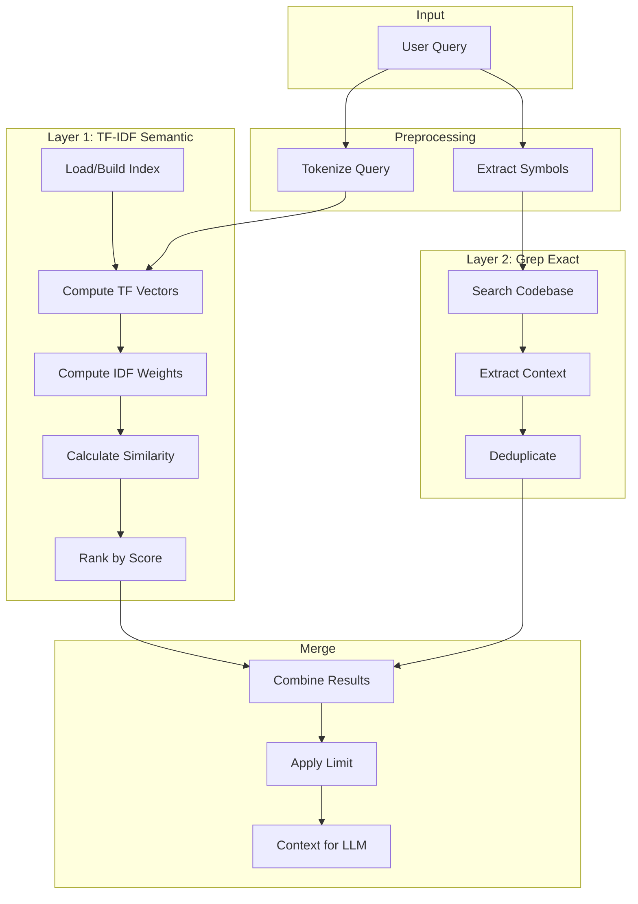
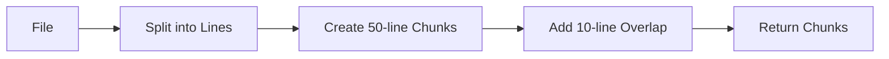
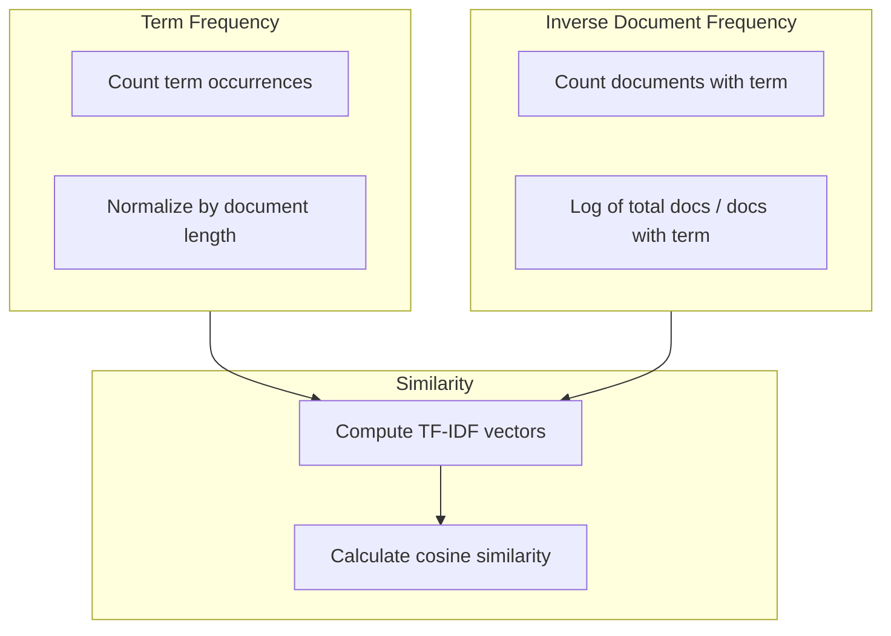
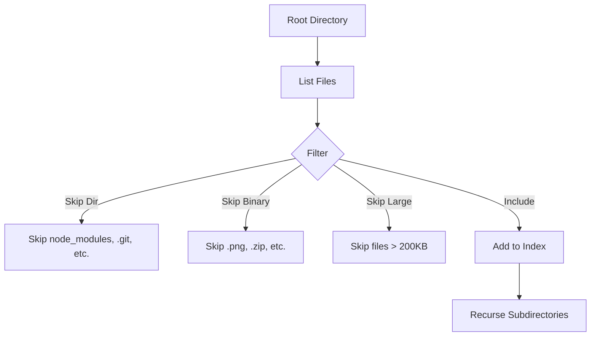
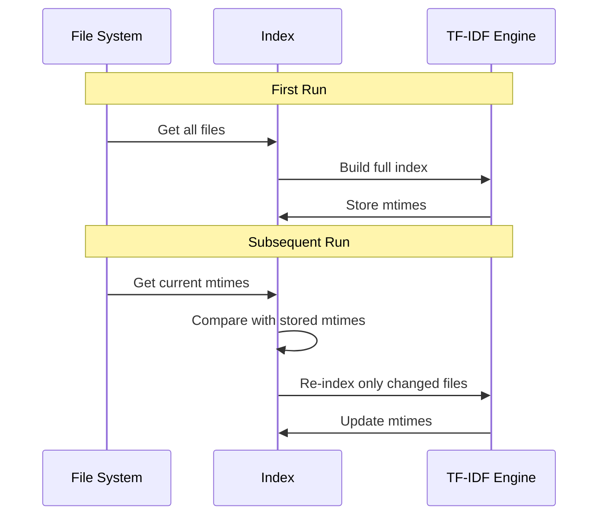
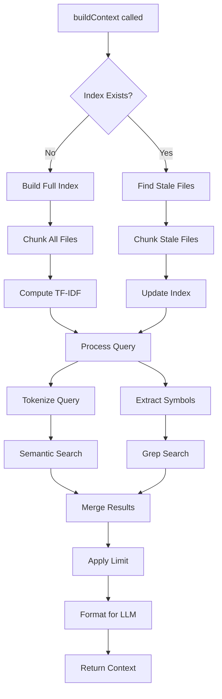

# Context Retrieval System

DREX Core implements a sophisticated hybrid context retrieval system that combines semantic search with exact symbol matching. This two-layer approach ensures the LLM receives both conceptually relevant code and precise symbol references.

---

## Hybrid Strategy Overview



### Why Two Layers?

| Layer | Purpose | Best For |
|-------|---------|----------|
| **TF-IDF** | Semantic similarity | Natural language queries, conceptual understanding |
| **Grep** | Exact symbol matching | Function names, class names, specific identifiers |

**Example**: When a user asks "Update the `processUserData` function to handle null values":
- **TF-IDF** finds code related to user data processing, null handling patterns
- **Grep** finds exact occurrences of `processUserData` symbol

---

## Core Components

### 1. Chunker (`context/chunker.ts`)

The chunker splits files into manageable pieces for indexing.

#### Chunk Structure

```typescript
interface RawChunk {
  /** Source file path */
  filePath: string;
  
  /** Starting line number (1-indexed) */
  startLine: number;
  
  /** Ending line number */
  endLine: number;
  
  /** The actual code content */
  content: string;
}
```

#### Chunking Algorithm



**Configuration:**
- **Chunk Size**: 50 lines
- **Overlap**: 10 lines

**Why Overlap?** Overlap ensures that important code spanning chunk boundaries is not lost. A function definition at line 48 might have its body in the next chunk - overlap captures both.

```typescript
function chunkFile(content: string, filePath: string): RawChunk[] {
  const lines = content.split('\n');
  const chunks: RawChunk[] = [];
  const chunkSize = 50;
  const overlap = 10;
  
  for (let i = 0; i < lines.length; i += chunkSize - overlap) {
    const startLine = i + 1;  // 1-indexed
    const endLine = Math.min(i + chunkSize, lines.length);
    const chunkContent = lines.slice(i, endLine).join('\n');
    
    chunks.push({
      filePath,
      startLine,
      endLine,
      content: chunkContent,
    });
    
    if (endLine >= lines.length) break;
  }
  
  return chunks;
}
```

---

### 2. TF-IDF Engine (`context/tfidf.ts`)

A native TypeScript implementation of Term Frequency-Inverse Document Frequency for semantic search.

#### Key Concepts



#### Interface Reference

```typescript
interface TFIDFIndex {
  /** Map of document IDs to term frequency vectors */
  documents: Map<string, Map<string, number>>;
  
  /** Map of terms to inverse document frequency */
  idf: Map<string, number>;
  
  /** Total number of documents */
  docCount: number;
  
  /** File modification times for incremental updates */
  mtimes: Map<string, number>;
}
```

#### Core Functions

**Tokenization:**
```typescript
function tokenize(text: string): string[] {
  return text
    .toLowerCase()
    .replace(/[^\w\s]/g, ' ')
    .split(/\s+/)
    .filter(token => token.length > 2);  // Filter short tokens
}
```

**Term Frequency:**
```typescript
function computeTF(tokens: string[]): Map<string, number> {
  const tf = new Map<string, number>();
  const total = tokens.length;
  
  for (const token of tokens) {
    tf.set(token, (tf.get(token) || 0) + 1);
  }
  
  // Normalize by document length
  for (const [term, count] of tf) {
    tf.set(term, count / total);
  }
  
  return tf;
}
```

**Inverse Document Frequency:**
```typescript
function computeIDF(
  term: string,
  documents: Map<string, Map<string, number>>
): number {
  const docCount = documents.size;
  const docsWithTerm = Array.from(documents.values())
    .filter(tf => tf.has(term)).length;
  
  return Math.log((docCount + 1) / (docsWithTerm + 1)) + 1;
}
```

**Cosine Similarity:**
```typescript
function cosineSimilarity(
  vecA: Map<string, number>,
  vecB: Map<string, number>
): number {
  let dotProduct = 0;
  let normA = 0;
  let normB = 0;
  
  const allTerms = new Set([...vecA.keys(), ...vecB.keys()]);
  
  for (const term of allTerms) {
    const a = vecA.get(term) || 0;
    const b = vecB.get(term) || 0;
    
    dotProduct += a * b;
    normA += a * a;
    normB += b * b;
  }
  
  return dotProduct / (Math.sqrt(normA) * Math.sqrt(normB));
}
```

#### Index Persistence

The TF-IDF index is persisted to disk for fast startup:

```
.drex/
└── index/
    └── tfidf.json
```

**Index Structure:**
```json
{
  "documents": {
    "src/agent.ts:1-50": {
      "runagent": 0.02,
      "config": 0.015,
      "task": 0.025
    }
  },
  "idf": {
    "function": 2.45,
    "const": 1.89,
    "async": 2.12
  },
  "docCount": 150,
  "mtimes": {
    "src/agent.ts": 1709876543210,
    "src/llm.ts": 1709876543210
  }
}
```

---

### 3. Grep Engine (`context/grep.ts`)

Exact symbol matching for precise code location.

#### Symbol Extraction

The grep engine extracts symbols from queries using multiple patterns:

```typescript
function extractSymbols(query: string): string[] {
  const symbols: string[] = [];
  
  // CamelCase identifiers: processUserData
  const camelCase = query.match(/[a-z][a-zA-Z0-9]*/g) || [];
  
  // Dotted paths: module.submodule.function
  const dotted = query.match(/[a-zA-Z_][a-zA-Z0-9_]*(?:\.[a-zA-Z_][a-zA-Z0-9_]*)+/g) || [];
  
  // File paths: src/module/file.ts
  const filePaths = query.match(/[a-zA-Z0-9_\-/]+\.[a-zA-Z]{1,4}/g) || [];
  
  return [...new Set([...camelCase, ...dotted, ...filePaths])];
}
```

#### Match Structure

```typescript
interface GrepMatch {
  /** Source file path */
  filePath: string;
  
  /** Line number of the match */
  line: number;
  
  /** The matched symbol */
  symbol: string;
  
  /** Context lines around the match */
  context: string;
}
```

#### Context Extraction

For each match, 50 lines of context are extracted:

```typescript
function extractContext(
  content: string,
  matchLine: number,
  contextLines: number = 50
): string {
  const lines = content.split('\n');
  const start = Math.max(0, matchLine - contextLines);
  const end = Math.min(lines.length, matchLine + contextLines);
  
  return lines.slice(start, end).join('\n');
}
```

---

### 4. File Tree Builder (`context/fileTree.ts`)

Constructs a recursive tree of the project structure for context.

#### File Info Structure

```typescript
interface SourceFileInfo {
  /** File path relative to root */
  path: string;
  
  /** File size in bytes */
  size: number;
  
  /** Last modification time */
  mtime: number;
  
  /** File extension */
  extension: string;
}
```

#### Skip Rules

Certain directories and files are excluded from indexing:

```typescript
const SKIP_DIRS = new Set([
  'node_modules',
  '.git',
  '.drex',
  'dist',
  'build',
  '.next',
  '__pycache__',
  'venv',
  '.venv',
]);

const BINARY_EXTENSIONS = new Set([
  '.png', '.jpg', '.jpeg', '.gif', '.ico',
  '.pdf', '.zip', '.tar', '.gz',
  '.exe', '.dll', '.so', '.dylib',
  '.mp3', '.mp4', '.wav', '.avi',
]);

const MAX_FILE_SIZE = 200 * 1024;  // 200KB
```

#### Tree Construction



---

## Incremental Indexing

DREX Core optimizes performance by only re-indexing changed files.

### How It Works



### Implementation

```typescript
function getStaleFiles(
  currentFiles: SourceFileInfo[],
  storedMtimes: Map<string, number>
): { stale: SourceFileInfo[], removed: string[] } {
  const stale: SourceFileInfo[] = [];
  const removed: string[] = [];
  
  const currentPaths = new Set(currentFiles.map(f => f.path));
  
  // Find stale (modified) files
  for (const file of currentFiles) {
    const storedMtime = storedMtimes.get(file.path);
    if (!storedMtime || file.mtime > storedMtime) {
      stale.push(file);
    }
  }
  
  // Find removed files
  for (const path of storedMtimes.keys()) {
    if (!currentPaths.has(path)) {
      removed.push(path);
    }
  }
  
  return { stale, removed };
}
```

### Benefits

| Scenario | Full Index | Incremental |
|----------|------------|-------------|
| First run | ~5 seconds | ~5 seconds |
| One file changed | ~5 seconds | ~50ms |
| 10 files changed | ~5 seconds | ~200ms |
| No changes | ~5 seconds | ~10ms |

---

## Context Building Flow

The complete context building process:



### Context Result

```typescript
interface ContextResult {
  /** Combined context string for the LLM */
  context: string;
  
  /** Source files included */
  sources: string[];
  
  /** Number of chunks retrieved */
  chunkCount: number;
  
  /** Number of grep matches */
  grepMatchCount: number;
}
```

---

## Performance Tuning

### Chunk Size

Adjust based on your codebase:

| Chunk Size | Use Case |
|------------|----------|
| 30 lines | Small, focused functions |
| 50 lines | Default, balanced |
| 100 lines | Large classes, verbose code |

### Context Limits

Default limits prevent context overflow:

```typescript
const MAX_CHUNKS = 20;      // Maximum TF-IDF chunks
const MAX_GREP_MATCHES = 10; // Maximum grep matches
const MAX_CONTEXT_SIZE = 50000; // Maximum characters
```

### Index Location

The index is stored in `.drex/index/`:

```
.drex/
├── index/
│   └── tfidf.json
└── memory/
    └── core.json
```

Add to `.gitignore`:
```
.drex/
```

---

## Next Steps

- [Execution & Verification](execution-verification.md) - How actions are executed and verified
- [API Reference](api-reference.md) - Integration examples
- [LLM Configuration](llm-config.md) - Configure your LLM provider
