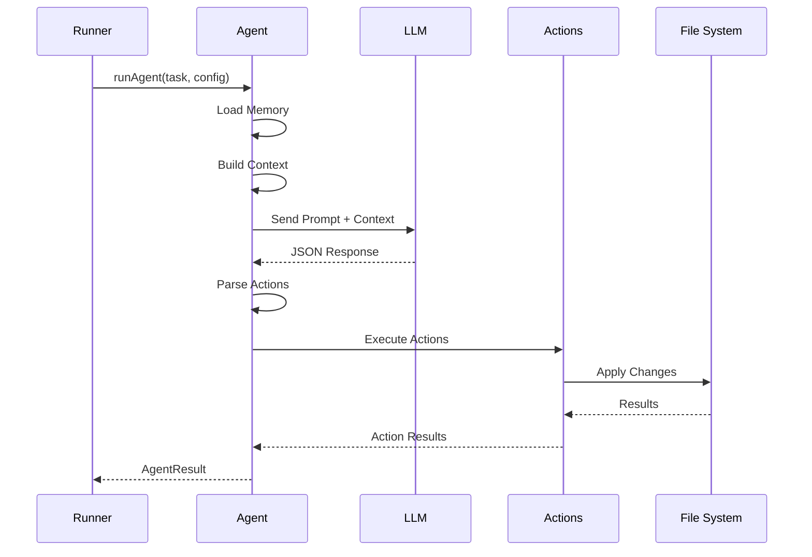
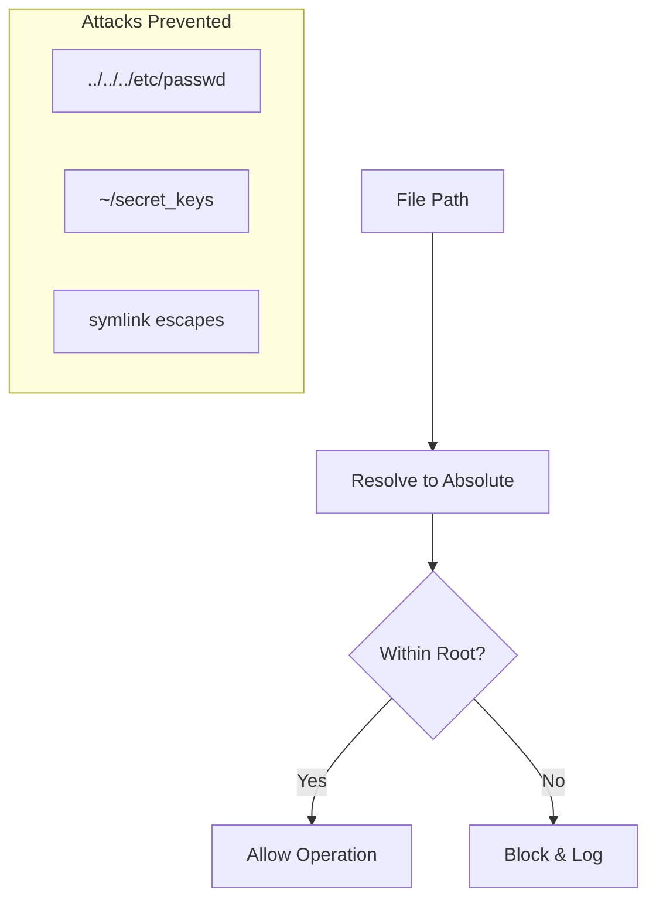
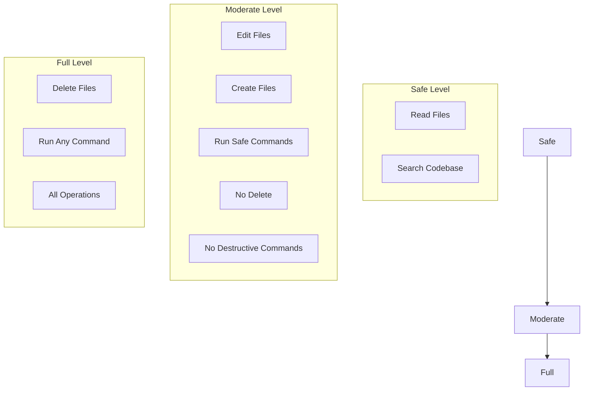
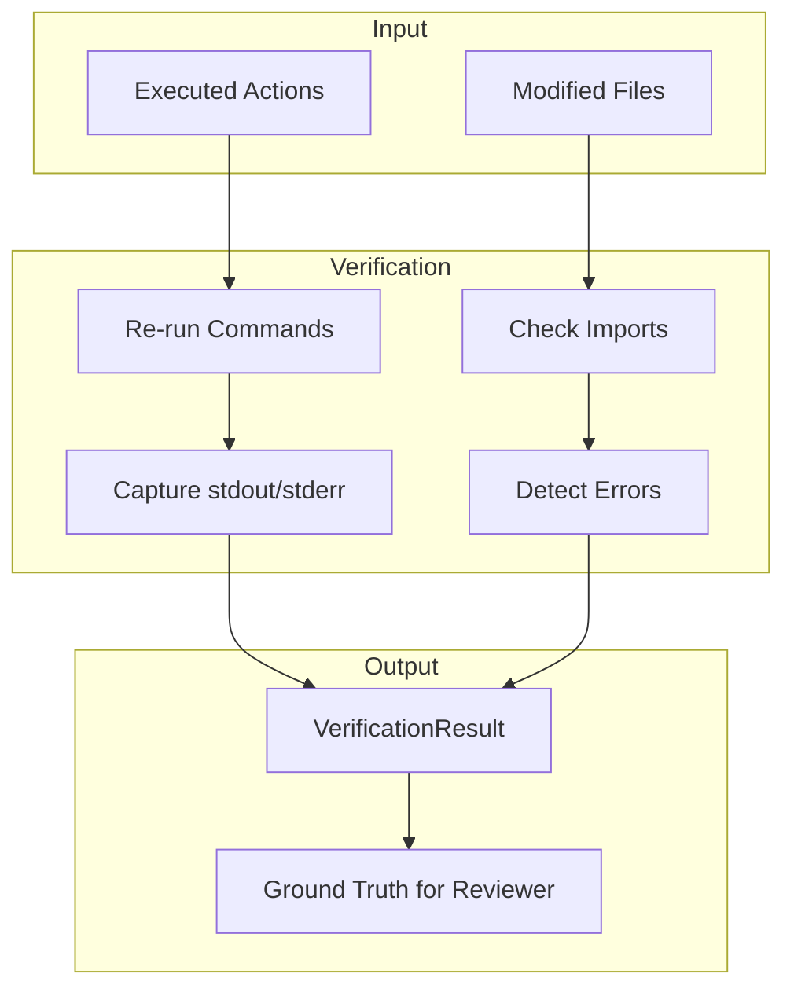
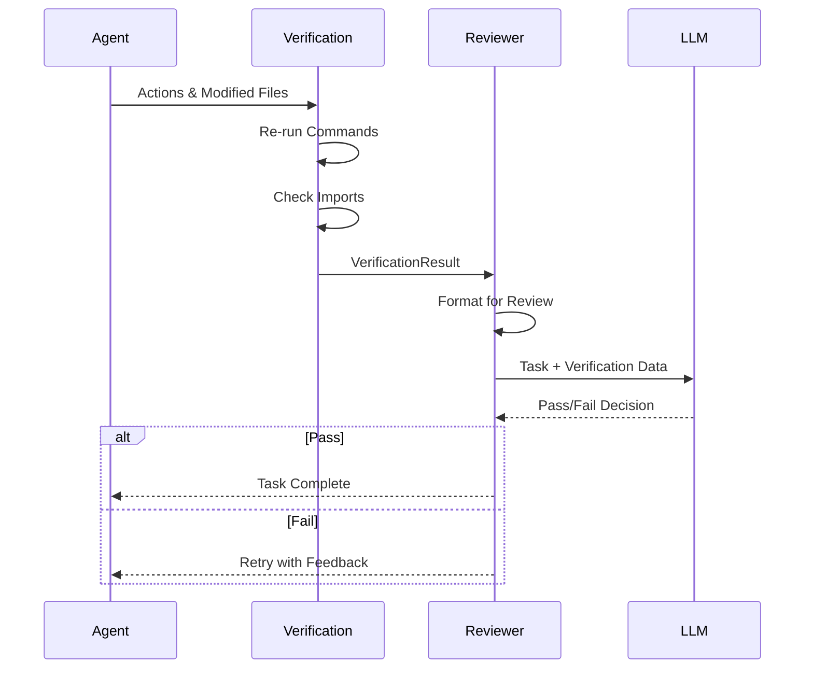
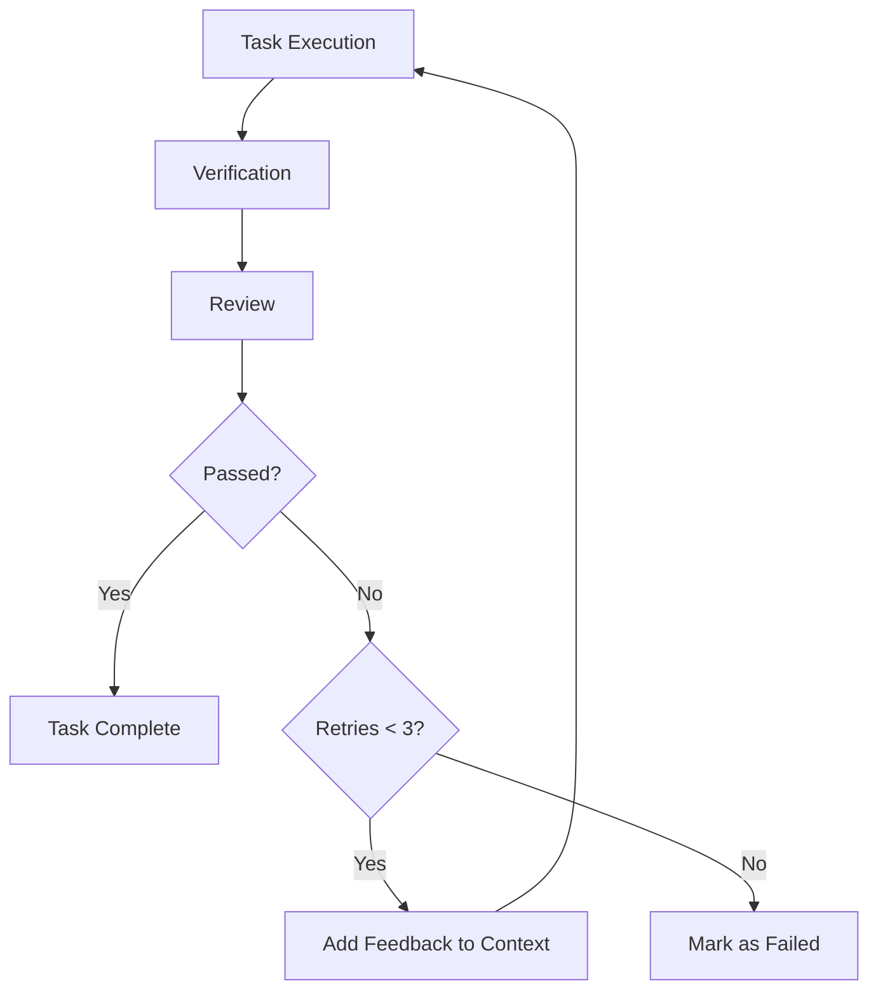

# Execution & Verification Layer

The Execution & Verification Layer is DREX Core's safety-critical subsystem that ensures actions are executed correctly and changes are validated. This document covers the agent lifecycle, safety mechanisms, and the verification system.

---

## Agent Lifecycle

The Agent (`src/agent.ts`) is responsible for parsing LLM outputs into structured actions and executing them against the codebase.

### Lifecycle Flow



### Agent Configuration

```typescript
interface AgentConfig {
  /** LLM configuration */
  llm: LLMConfig;
  
  /** Root directory for operations */
  rootDir: string;
  
  /** Permission level */
  permissionLevel: PermissionLevel;
  
  /** Memory file path */
  memoryPath?: string;
}

interface AgentTask {
  /** Task ID */
  id: string;
  
  /** Task description */
  description: string;
  
  /** Files to focus on */
  files?: string[];
  
  /** Dependencies (completed) */
  dependencies?: string[];
}

interface AgentResult {
  /** Task ID */
  taskId: string;
  
  /** Actions taken */
  actions: Action[];
  
  /** Results of each action */
  results: ActionResult[];
  
  /** Files modified */
  modifiedFiles: string[];
  
  /** Success status */
  success: boolean;
  
  /** Error message if failed */
  error?: string;
}
```

### Action Parsing

The Agent uses a structured system prompt to ensure the LLM returns valid JSON actions:

```typescript
const AGENT_SYSTEM_PROMPT = `
You are a coding agent. Respond with a JSON array of actions.

Available actions:
- edit_file: { "type": "edit_file", "path": "...", "old_str": "...", "new_str": "..." }
- create_file: { "type": "create_file", "path": "...", "content": "..." }
- delete_file: { "type": "delete_file", "path": "..." }
- run_command: { "type": "run_command", "command": "...", "cwd": "..." }

Respond ONLY with valid JSON. No explanations.
`;
```

#### Parsing Logic

```typescript
function parseActions(response: string): Action[] {
  // Try to extract JSON from the response
  const jsonMatch = response.match(/\[[\s\S]*\]/);
  if (!jsonMatch) {
    throw new Error('No valid JSON array found in response');
  }
  
  const actions = JSON.parse(jsonMatch[0]);
  
  // Validate each action
  for (const action of actions) {
    if (!action.type || !['edit_file', 'create_file', 'delete_file', 'run_command'].includes(action.type)) {
      throw new Error(`Invalid action type: ${action.type}`);
    }
  }
  
  return actions;
}
```

---

## Safety Layers

DREX Core implements multiple safety layers to prevent dangerous operations.

### Layer 1: Path Validation

All file operations are validated against path traversal attacks:



#### Implementation

```typescript
function validatePath(requestedPath: string, rootDir: string): string {
  // Resolve to absolute path
  const absolutePath = path.resolve(rootDir, requestedPath);
  
  // Normalize to prevent traversal
  const normalizedPath = path.normalize(absolutePath);
  
  // Check if within root directory
  if (!normalizedPath.startsWith(rootDir)) {
    throw new Error(`Path traversal detected: ${requestedPath}`);
  }
  
  return normalizedPath;
}
```

### Layer 2: Blocked Commands

Dangerous shell commands are blocked regardless of permission level:

```typescript
const BLOCKED_COMMANDS = [
  /rm\s+-rf\s+\//,           // rm -rf /
  /rm\s+-rf\s+~/,            // rm -rf ~
  /rm\s+-rf\s+\*/,           // rm -rf *
  /:\(\)\{.*;\};:\(\)/,       // Fork bombs
  /curl.*\|\s*bash/,         // curl | bash
  /wget.*\|\s*bash/,         // wget | bash
  /curl.*\|\s*sh/,           // curl | sh
  /wget.*\|\s*sh/,           // wget | sh
  /dd\s+if=.*of=\/dev\//,    // dd to device
  /mkfs/,                     // Format filesystem
  /fdisk/,                    // Disk partitioning
  /shutdown/,                 // System shutdown
  /reboot/,                   // System reboot
  /init\s+0/,                 // Init shutdown
  /chmod\s+777/,              // Dangerous permissions
  /chown\s+.*:.*\//,          // Recursive ownership change
  />\s*\/dev\/sda/,           // Overwrite disk
  /mv\s+.*\s+\/dev\/null/,    // Delete via null
];
```

#### Command Validation

```typescript
function validateCommand(command: string): void {
  for (const pattern of BLOCKED_COMMANDS) {
    if (pattern.test(command)) {
      throw new Error(`Blocked command pattern detected: ${command}`);
    }
  }
}
```

### Layer 3: Permission Checks

Permission levels control what actions are allowed:



#### Permission Check Implementation

```typescript
type PermissionLevel = 'safe' | 'moderate' | 'full';

function checkPermission(
  action: Action,
  level: PermissionLevel
): boolean {
  switch (level) {
    case 'safe':
      // Only read operations
      return action.type === 'run_command' && 
             isReadCommand(action.command);
    
    case 'moderate':
      // No delete or destructive commands
      if (action.type === 'delete_file') return false;
      if (action.type === 'run_command') {
        return !isDestructiveCommand(action.command);
      }
      return true;
    
    case 'full':
      // All operations allowed (except blocked patterns)
      return true;
    
    default:
      return false;
  }
}

function isDestructiveCommand(command: string): boolean {
  const destructive = [
    /rm\s+/,
    /rmdir/,
    /drop\s+table/i,
    /truncate\s+table/i,
    /delete\s+from/i,
  ];
  return destructive.some(p => p.test(command));
}
```

---

## Verification System

The Verification system (`src/verification.ts`) validates that changes work correctly.

### Verification Flow



### Verification Interfaces

```typescript
interface CommandVerification {
  /** Original command */
  command: string;
  
  /** Working directory */
  cwd: string;
  
  /** Exit code */
  exitCode: number;
  
  /** Standard output */
  stdout: string;
  
  /** Standard error */
  stderr: string;
  
  /** Duration in ms */
  duration: number;
}

interface BrokenImport {
  /** File containing the import */
  file: string;
  
  /** The import statement */
  importStatement: string;
  
  /** The module being imported */
  module: string;
  
  /** Reason for failure */
  reason: 'not_found' | 'parse_error' | 'extension_mismatch';
}

interface VerificationResult {
  /** Command verification results */
  commands: CommandVerification[];
  
  /** Broken imports found */
  brokenImports: BrokenImport[];
  
  /** Overall success */
  success: boolean;
  
  /** Summary of issues */
  issues: string[];
}
```

### Command Re-running

The system re-runs commands to capture their actual output:

```typescript
async function rerunCommands(
  actions: Action[],
  rootDir: string
): Promise<CommandVerification[]> {
  const results: CommandVerification[] = [];
  
  for (const action of actions) {
    if (action.type !== 'run_command') continue;
    
    const start = Date.now();
    
    try {
      const proc = Bun.spawn(action.command.split(' '), {
        cwd: action.cwd || rootDir,
        stdout: 'pipe',
        stderr: 'pipe',
      });
      
      const stdout = await new Response(proc.stdout).text();
      const stderr = await new Response(proc.stderr).text();
      const exitCode = await proc.exited;
      
      results.push({
        command: action.command,
        cwd: action.cwd || rootDir,
        exitCode,
        stdout,
        stderr,
        duration: Date.now() - start,
      });
    } catch (error) {
      results.push({
        command: action.command,
        cwd: action.cwd || rootDir,
        exitCode: -1,
        stdout: '',
        stderr: error.message,
        duration: Date.now() - start,
      });
    }
  }
  
  return results;
}
```

### Import Checking

The system verifies that all imports in modified files resolve correctly:

```typescript
async function checkImports(
  filePaths: string[],
  rootDir: string
): Promise<BrokenImport[]> {
  const broken: BrokenImport[] = [];
  
  for (const filePath of filePaths) {
    const content = await Bun.file(filePath).text();
    const imports = extractImports(content);
    
    for (const imp of imports) {
      const resolved = await resolveImport(imp.module, filePath, rootDir);
      
      if (!resolved.found) {
        broken.push({
          file: filePath,
          importStatement: imp.statement,
          module: imp.module,
          reason: resolved.reason,
        });
      }
    }
  }
  
  return broken;
}
```

#### Import Resolution

```typescript
async function resolveImport(
  module: string,
  fromFile: string,
  rootDir: string
): Promise<{ found: boolean; reason?: string }> {
  // Node modules
  if (!module.startsWith('.')) {
    try {
      require.resolve(module, { paths: [rootDir] });
      return { found: true };
    } catch {
      return { found: false, reason: 'not_found' };
    }
  }
  
  // Relative imports
  const dir = path.dirname(fromFile);
  let resolvedPath = path.resolve(dir, module);
  
  // Handle ESM extensions (.js -> .ts)
  if (module.endsWith('.js')) {
    const tsPath = resolvedPath.replace(/\.js$/, '.ts');
    if (await exists(tsPath)) {
      return { found: true };
    }
  }
  
  // Try common extensions
  const extensions = ['.ts', '.tsx', '.js', '.jsx', '.json'];
  for (const ext of extensions) {
    if (await exists(resolvedPath + ext)) {
      return { found: true };
    }
  }
  
  // Try index files
  for (const ext of extensions) {
    if (await exists(path.join(resolvedPath, `index${ext}`))) {
      return { found: true };
    }
  }
  
  return { found: false, reason: 'not_found' };
}
```

---

## Reviewer Integration

The verification results serve as "Ground Truth" for the Reviewer.

### Ground Truth Flow



### Formatting for Review

```typescript
function formatVerificationForReview(result: VerificationResult): string {
  const parts: string[] = [];
  
  if (result.commands.length > 0) {
    parts.push('## Command Results\n');
    for (const cmd of result.commands) {
      parts.push(`### ${cmd.command}`);
      parts.push(`Exit Code: ${cmd.exitCode}`);
      if (cmd.stdout) parts.push(`\nStdout:\n\`\`\`\n${cmd.stdout}\n\`\`\``);
      if (cmd.stderr) parts.push(`\nStderr:\n\`\`\`\n${cmd.stderr}\n\`\`\``);
    }
  }
  
  if (result.brokenImports.length > 0) {
    parts.push('\n## Broken Imports\n');
    for (const imp of result.brokenImports) {
      parts.push(`- ${imp.file}: ${imp.module} (${imp.reason})`);
    }
  }
  
  if (result.issues.length > 0) {
    parts.push('\n## Issues\n');
    for (const issue of result.issues) {
      parts.push(`- ${issue}`);
    }
  }
  
  return parts.join('\n');
}
```

### Reviewer Prompt

```typescript
const REVIEW_SYSTEM_PROMPT = `
You are a code reviewer. Evaluate if the task was completed successfully.

Task: {task}
Verification Results: {verification}

Respond with JSON:
{
  "passed": boolean,
  "feedback": "string explaining why passed or failed"
}
`;
```

---

## Retry Mechanism

When verification or review fails, tasks are retried with feedback.

### Retry Flow



### Implementation

```typescript
const MAX_RETRIES = 3;

async function processTask(
  task: AgentTask,
  config: AgentConfig,
  retryCount: number = 0
): Promise<AgentResult> {
  // Execute task
  const result = await runAgent(task, config);
  
  // Run verification
  const verification = await runVerification(result, config.rootDir);
  
  // Review results
  const review = await reviewTask(task, result, verification, config);
  
  if (review.passed) {
    return { ...result, success: true };
  }
  
  if (retryCount >= MAX_RETRIES) {
    return {
      ...result,
      success: false,
      error: `Max retries exceeded. Last feedback: ${review.feedback}`,
    };
  }
  
  // Retry with feedback
  const enhancedTask = {
    ...task,
    description: `${task.description}\n\nPrevious attempt feedback: ${review.feedback}`,
  };
  
  return processTask(enhancedTask, config, retryCount + 1);
}
```

---

## Error Handling

### Action Errors

```typescript
interface ActionResult {
  /** Action that was executed */
  action: Action;
  
  /** Success status */
  success: boolean;
  
  /** Error message if failed */
  error?: string;
  
  /** Output (for commands) */
  output?: string;
}
```

### Error Categories

| Category | Example | Handling |
|----------|---------|----------|
| **Path Traversal** | `../../../etc/passwd` | Block immediately |
| **Blocked Command** | `rm -rf /` | Block immediately |
| **Permission Denied** | Delete in 'moderate' mode | Block with message |
| **File Not Found** | Edit non-existent file | Return error, allow retry |
| **Command Failed** | Non-zero exit code | Capture output, allow retry |
| **Broken Import** | Missing module | Report to reviewer |

---

## Best Practices

### 1. Use Appropriate Permission Levels

```typescript
// For read-only analysis
const config = { permissionLevel: 'safe' };

// For standard development
const config = { permissionLevel: 'moderate' };

// Only for trusted, isolated environments
const config = { permissionLevel: 'full' };
```

### 2. Handle Verification Failures

```typescript
drex.on('task:done', (result) => {
  if (result.verification?.issues.length > 0) {
    console.warn('Verification issues:', result.verification.issues);
  }
});
```

### 3. Monitor Retry Counts

```typescript
drex.on('task:start', (task) => {
  console.log(`Task ${task.id} attempt ${task.retryCount + 1}/${MAX_RETRIES}`);
});
```

---

## Next Steps

- [API Reference](api-reference.md) - Integration guide and examples
- [LLM Configuration](llm-config.md) - Configure your LLM provider
- [Context Retrieval](context-retrieval.md) - Understanding the context system
