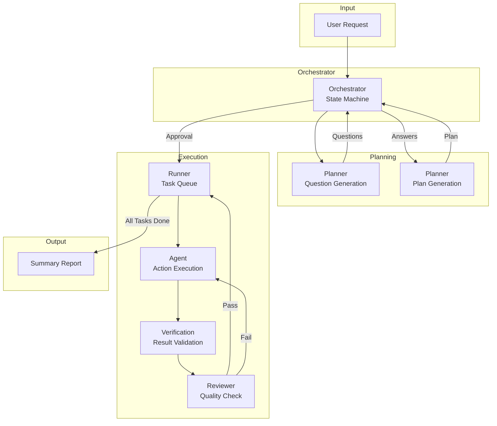
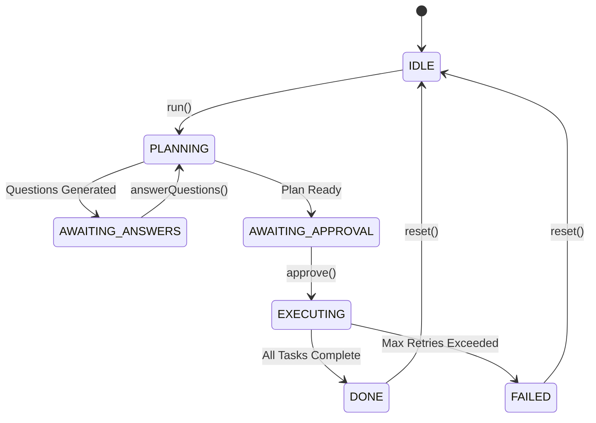
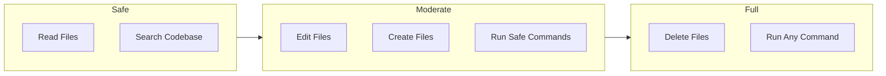
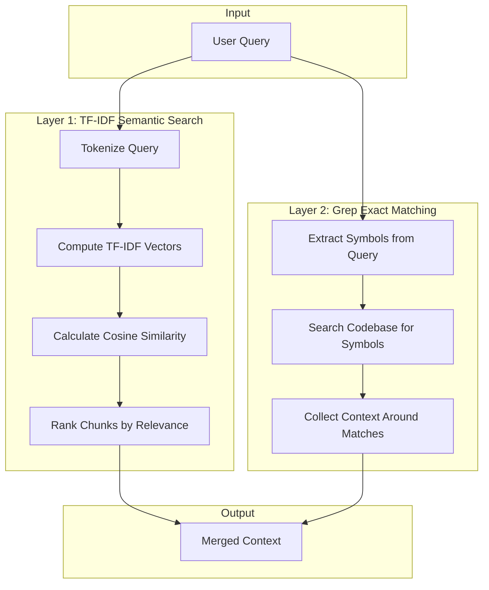

# DREX Core Engine Documentation

## What is DREX Core?

DREX Core is an autonomous multi-agent AI coding system built for **Bun**. It provides a sophisticated orchestration layer that enables AI agents to plan, execute, and verify code changes across a codebase with minimal human intervention.

### Key Features

- **Autonomous Multi-Agent Architecture**: Orchestrates multiple specialized agents (Planner, Runner, Agent, Reviewer) working in concert
- **Hybrid Context Retrieval**: Combines TF-IDF semantic search with exact symbol matching via Grep for precise code understanding
- **Execution Verification Layer**: Automatically validates changes by re-running commands and checking for broken imports
- **Model-Agnostic LLM Integration**: Uses raw `fetch` for OpenAI-compatible APIs, supporting any compliant provider
- **Zero Core Dependencies**: Native TF-IDF implementation, no external NLP libraries required
- **Safety-First Design**: Multiple permission levels and blocked command patterns for secure execution

---

## Architecture Overview

DREX Core follows a pipeline architecture where each component has a specific responsibility in the autonomous coding workflow.

### Component Flow



### Component Responsibilities

| Component | File | Responsibility |
|-----------|------|----------------|
| **Orchestrator** | `src/orchestrator.ts` | State machine management, event emission, coordination |
| **Planner** | `src/modes/planner.ts` | Generates clarifying questions and execution plans |
| **Runner** | `src/runner.ts` | Manages task queue and worker pool for parallel execution |
| **Agent** | `src/agent.ts` | Parses LLM outputs into structured actions and executes them |
| **Reviewer** | `src/modes/review.ts` | Validates task completion against requirements |
| **Verification** | `src/verification.ts` | Re-runs commands and checks for broken imports |

---

## State Machine

The Orchestrator manages execution through a finite state machine with the following states:



### State Descriptions

| State | Description |
|-------|-------------|
| **IDLE** | Initial state. Ready to accept a new task. |
| **PLANNING** | The Planner is generating questions or a plan based on the user request. |
| **AWAITING_ANSWERS** | Questions have been generated and the system is waiting for user answers. |
| **AWAITING_APPROVAL** | A plan has been generated and is awaiting user approval before execution. |
| **EXECUTING** | Tasks are being executed by the Runner and Agent components. |
| **DONE** | All tasks have been completed successfully. |
| **FAILED** | Execution failed after maximum retry attempts (3 retries per task). |

### State Transitions

```typescript
type OrchestratorState = 
  | 'IDLE'
  | 'PLANNING'
  | 'AWAITING_ANSWERS'
  | 'AWAITING_APPROVAL'
  | 'EXECUTING'
  | 'DONE'
  | 'FAILED';
```

---

## Permission Levels

DREX Core implements a three-tier permission system to control the scope of actions an agent can perform:

### Permission Hierarchy



### Permission Definitions

| Level | Value | Allowed Actions | Use Case |
|-------|-------|-----------------|----------|
| **Safe** | `'safe'` | Read files, search codebase | Read-only analysis, code review |
| **Moderate** | `'moderate'` | Edit files, create files, run safe commands | Standard development tasks |
| **Full** | `'full'` | All actions including delete and any commands | Full autonomy, trusted environments |

### Blocked Commands

Regardless of permission level, certain dangerous commands are always blocked:

```typescript
const BLOCKED_COMMANDS = [
  /rm\s+-rf\s+\//,           // rm -rf /
  /rm\s+-rf\s+~/,            // rm -rf ~
  /:\(\)\{.*;\};:\(\)/,       // Fork bombs
  /curl.*\|\s*bash/,         // curl | bash
  /wget.*\|\s*bash/,         // wget | bash
  /dd\s+if=.*of=\/dev\//,    // dd to device
  /mkfs/,                     // Format filesystem
  /shutdown/,                 // System shutdown
  /reboot/,                   // System reboot
  /init\s+0/,                 // Init shutdown
];
```

---

## RAG Context Strategy

DREX Core uses a hybrid two-layer retrieval strategy to provide relevant context to the LLM:

### Retrieval Flow



### Why Hybrid Retrieval?

| Approach | Strengths | Weaknesses |
|----------|-----------|------------|
| **TF-IDF Only** | Good semantic understanding, handles natural language queries | May miss exact symbol references |
| **Grep Only** | Precise symbol matching, exact code locations | No semantic understanding |
| **Hybrid** | Best of both worlds - semantic + exact matching | Slightly more complex |

The hybrid approach ensures that when a user asks about a specific function like `processUserData`, the system finds both:
1. Semantically related code (via TF-IDF)
2. Exact references to `processUserData` (via Grep)

---

## Key Concepts

### Incremental Indexing

The context system uses file modification times (`mtime`) to optimize performance:

1. On first run, all files are indexed and their `mtime` is recorded
2. On subsequent runs, only files with changed `mtime` are re-indexed
3. Index is persisted to `.drex/index/tfidf.json`

### Chunking Strategy

Files are split into overlapping chunks for better context retrieval:

- **Chunk Size**: 50 lines
- **Overlap**: 10 lines
- **Purpose**: Ensures context continuity across chunk boundaries

### Task Dependencies

Plans can specify task dependencies for ordered execution:

```
[TASK_1] Edit the configuration file
[TASK_2: DEPS:TASK_1] Update the main module
[TASK_3: DEPS:TASK_1,TASK_2] Run tests
```

### Retry Mechanism

Each task has a maximum of **3 retry attempts**:
1. Agent executes actions
2. Verification runs checks
3. Reviewer evaluates results
4. If failed, task is retried with verification feedback
5. After 3 failures, the entire run fails

---

## Next Steps

- [LLM Configuration](llm-config.md) - Configure your LLM provider
- [Context Retrieval](context-retrieval.md) - Deep dive into the retrieval system
- [Execution & Verification](execution-verification.md) - Understand the safety layers
- [API Reference](api-reference.md) - Integration guide and examples
