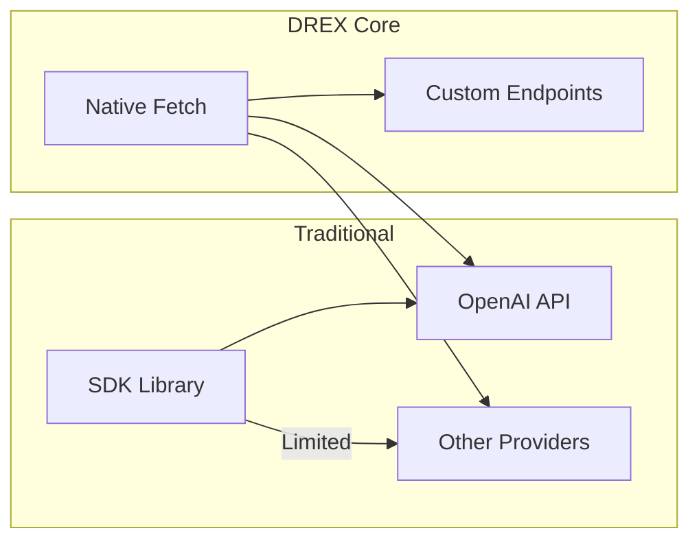
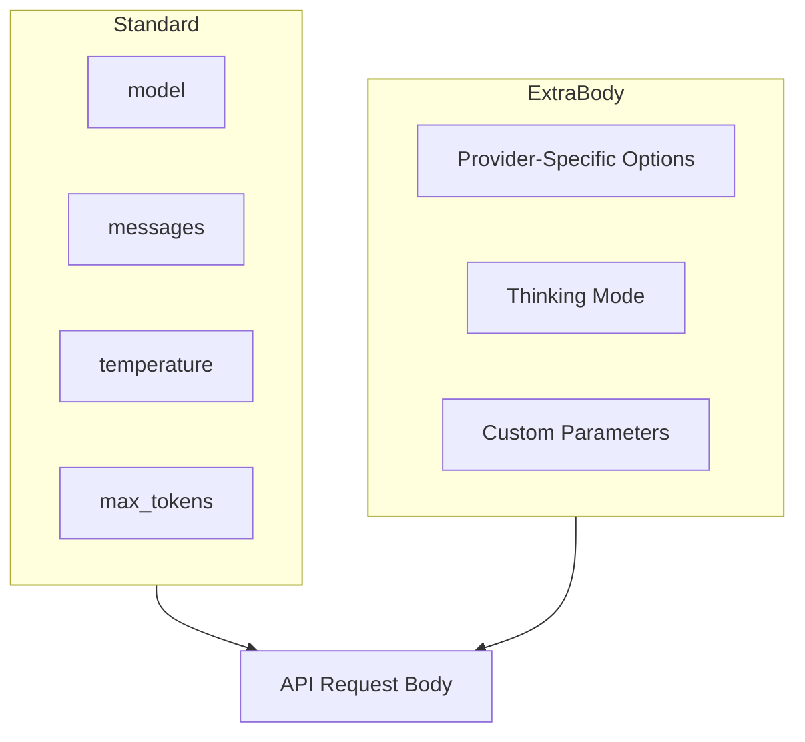

# LLM Layer & Configuration

DREX Core is designed to be model-agnostic, supporting any OpenAI-compatible API. This document covers the LLM integration layer, configuration options, and advanced features.

---

## OpenAI Compatibility

The LLM layer in `src/llm.ts` uses raw `fetch` calls instead of SDK libraries. This design choice ensures maximum compatibility with any OpenAI-compatible provider.

### Why Raw Fetch?



**Benefits:**
- **Zero Dependencies**: No external SDK required
- **Universal Compatibility**: Works with any OpenAI-compatible endpoint
- **Full Control**: Access to all provider-specific features via `extraBody`
- **Lightweight**: Reduces bundle size and attack surface

### API Call Structure

```typescript
async function callLLM(config: LLMConfig, messages: Message[]): Promise<string> {
  const response = await fetch(`${config.baseURL}/chat/completions`, {
    method: 'POST',
    headers: {
      'Content-Type': 'application/json',
      'Authorization': `Bearer ${config.apiKey}`,
    },
    body: JSON.stringify({
      model: config.model,
      messages,
      ...config.extraBody,
    }),
  });
  
  // Response handling...
}
```

---

## Interface Reference

### LLMConfig

The primary configuration interface for LLM connections:

```typescript
interface LLMConfig {
  /** Base URL for the API endpoint (default: 'https://api.openai.com/v1') */
  baseURL: string;
  
  /** API key for authentication */
  apiKey: string;
  
  /** Model identifier (e.g., 'gpt-4', 'claude-3-opus-20240229') */
  model: string;
  
  /** Additional parameters passed directly to the API body */
  extraBody?: Record<string, unknown>;
}
```

#### Configuration Examples

**OpenAI (Default):**
```typescript
const config: LLMConfig = {
  baseURL: 'https://api.openai.com/v1',
  apiKey: process.env.OPENAI_API_KEY!,
  model: 'gpt-4-turbo-preview',
};
```

**Anthropic via OpenAI-Compatible Proxy:**
```typescript
const config: LLMConfig = {
  baseURL: 'https://api.anthropic.com/v1',
  apiKey: process.env.ANTHROPIC_API_KEY!,
  model: 'claude-3-opus-20240229',
};
```

**Local LLM (Ollama/LMStudio):**
```typescript
const config: LLMConfig = {
  baseURL: 'http://localhost:11434/v1',
  apiKey: 'not-required',  // Some local servers still expect this field
  model: 'llama2',
};
```

**Custom Enterprise Endpoint:**
```typescript
const config: LLMConfig = {
  baseURL: 'https://llm.your-company.com/v1',
  apiKey: process.env.ENTERPRISE_API_KEY!,
  model: 'internal-model-v2',
};
```

### Message

The message interface follows the OpenAI chat format:

```typescript
interface Message {
  /** Role of the message sender */
  role: 'system' | 'user' | 'assistant';
  
  /** Content of the message */
  content: string;
}
```

#### Message Construction

```typescript
const messages: Message[] = [
  {
    role: 'system',
    content: 'You are a helpful coding assistant.',
  },
  {
    role: 'user',
    content: 'Create a function to calculate fibonacci numbers.',
  },
];
```

---

## Advanced Configuration

### The extraBody Parameter

The `extraBody` parameter allows passing provider-specific options directly to the API request body. This enables access to features beyond the standard OpenAI API.



### Provider-Specific Examples

#### Z.AI Thinking Mode

Z.AI supports a 'thinking' mode for enhanced reasoning:

```typescript
const config: LLMConfig = {
  baseURL: 'https://api.z.ai/v1',
  apiKey: process.env.Z_AI_KEY!,
  model: 'z-1-ultra',
  extraBody: {
    thinking: {
      type: 'enabled',
      budget_tokens: 10000,
    },
  },
};
```

#### OpenAI Function Calling

```typescript
const config: LLMConfig = {
  baseURL: 'https://api.openai.com/v1',
  apiKey: process.env.OPENAI_API_KEY!,
  model: 'gpt-4-turbo-preview',
  extraBody: {
    tools: [
      {
        type: 'function',
        function: {
          name: 'execute_code',
          description: 'Execute Python code',
          parameters: { /* ... */ },
        },
      },
    ],
    tool_choice: 'auto',
  },
};
```

#### Temperature and Sampling

```typescript
const config: LLMConfig = {
  baseURL: 'https://api.openai.com/v1',
  apiKey: process.env.OPENAI_API_KEY!,
  model: 'gpt-4',
  extraBody: {
    temperature: 0.7,
    top_p: 0.9,
    max_tokens: 4096,
    presence_penalty: 0.1,
    frequency_penalty: 0.1,
  },
};
```

#### Streaming Configuration

```typescript
const config: LLMConfig = {
  baseURL: 'https://api.openai.com/v1',
  apiKey: process.env.OPENAI_API_KEY!,
  model: 'gpt-4',
  extraBody: {
    stream: true,
    stream_options: {
      include_usage: true,
    },
  },
};
```

---

## DrexConfig

The main configuration interface for the DREX orchestrator:

```typescript
interface DrexConfig {
  /** LLM configuration */
  llm: LLMConfig;
  
  /** Root directory for operations (default: process.cwd()) */
  rootDir?: string;
  
  /** Permission level for actions (default: 'moderate') */
  permissionLevel?: PermissionLevel;
  
  /** Maximum concurrent tasks (default: 3) */
  maxConcurrency?: number;
  
  /** Enable verbose logging */
  verbose?: boolean;
}
```

### Complete Configuration Example

```typescript
import { Drex } from 'drex-core';

const drex = new Drex({
  llm: {
    baseURL: 'https://api.openai.com/v1',
    apiKey: process.env.OPENAI_API_KEY!,
    model: 'gpt-4-turbo-preview',
    extraBody: {
      temperature: 0.3,  // Lower for more deterministic code generation
      max_tokens: 8192,
    },
  },
  rootDir: '/path/to/project',
  permissionLevel: 'moderate',
  maxConcurrency: 3,
  verbose: true,
});
```

---

## Error Handling

The LLM layer handles common error scenarios:

### HTTP Errors

```typescript
// The callLLM function will throw on HTTP errors
try {
  const response = await callLLM(config, messages);
} catch (error) {
  if (error.status === 401) {
    // Invalid API key
  } else if (error.status === 429) {
    // Rate limited
  } else if (error.status === 500) {
    // Server error
  }
}
```

### Response Parsing

```typescript
// Malformed responses are handled gracefully
const data = await response.json();
if (!data.choices || !data.choices[0]) {
  throw new Error('Invalid response format from LLM');
}
return data.choices[0].message.content;
```

---

## Best Practices

### 1. Environment Variables

Never hardcode API keys:

```typescript
const config: LLMConfig = {
  baseURL: process.env.LLM_BASE_URL || 'https://api.openai.com/v1',
  apiKey: process.env.LLM_API_KEY!,
  model: process.env.LLM_MODEL || 'gpt-4',
};
```

### 2. Temperature Settings

For code generation tasks, use lower temperature values:

```typescript
extraBody: {
  temperature: 0.2,  // More deterministic output
}
```

For creative tasks like documentation, higher values may be appropriate:

```typescript
extraBody: {
  temperature: 0.7,  // More creative output
}
```

### 3. Token Limits

Set appropriate token limits based on your model:

```typescript
extraBody: {
  max_tokens: 4096,  // Adjust based on model capabilities
}
```

### 4. Retry Logic

Implement retry logic for rate limits:

```typescript
async function callWithRetry(config: LLMConfig, messages: Message[], retries = 3) {
  for (let i = 0; i < retries; i++) {
    try {
      return await callLLM(config, messages);
    } catch (error) {
      if (error.status === 429 && i < retries - 1) {
        await new Promise(r => setTimeout(r, 1000 * (i + 1)));
        continue;
      }
      throw error;
    }
  }
}
```

---

## Provider Compatibility Matrix

| Provider | Base URL | Notes |
|----------|----------|-------|
| OpenAI | `https://api.openai.com/v1` | Default, fully supported |
| Azure OpenAI | `https://YOUR_RESOURCE.openai.azure.com/openai/deployments/YOUR_DEPLOYMENT` | Requires `api-version` query param |
| Anthropic | `https://api.anthropic.com/v1` | Via OpenAI-compatible endpoint |
| Z.AI | `https://api.z.ai/v1` | Supports thinking mode via extraBody |
| Ollama | `http://localhost:11434/v1` | Local inference |
| LM Studio | `http://localhost:1234/v1` | Local inference |
| Together AI | `https://api.together.xyz/v1` | Open-source models |
| Groq | `https://api.groq.com/openai/v1` | Fast inference |
| OpenRouter | `https://openrouter.ai/api/v1` | Multi-provider gateway |

---

## Next Steps

- [Context Retrieval](context-retrieval.md) - How DREX builds context for the LLM
- [Execution & Verification](execution-verification.md) - Safety layers and validation
- [API Reference](api-reference.md) - Complete integration examples
